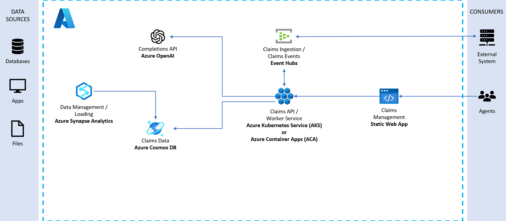

# Solution notes

## Architecture walkthrough



Once the solution is deployed, the architecture should look like the above diagram. The following is a brief description of the various components:

- The front end is a React web application deployed to an Azure Static Web app. This is how users interact with the solution.
- The API is an ASP.NET Core API app that serves as a lightweight layer for the business logic that lives inside of a .NET 7 class library. It is containerized in Docker and deployed to an Azure Container App (ACA) or Azure Kubernetes Service (AKS).
- The background worker service is a Microsoft.NET.Sdk.Worker project that also references the .NET 7 class library and is deployed into a different Docker container within the same AKS service or a dedicated ACA instance.
- All data is stored in Azure Cosmos DB. The background worker service acts as the Azure Cosmos DB change feed processor, which executes as data within the monitored Cosmos DB containers are inserted or updated, allowing for the application of business rules and automated updating of data within various containers.
- There is an Event Hubs instance that helps us simulate stream processing of incoming medical claims data from a fictitious external system. The background worker service also acts as the Event Hubs processor to write incoming claims added through Event Hubs into Cosmos DB.
- There is an Azure OpenAI deployment that provides a completion model, orchestrated by Semantic Kernel. This enables the application to provide recommendations to a claims adjudicator on whether to approve or reject a claim, based on the claims data and business rules.

## Running the solution locally

Before you can successfully run the solution locally, you need to do the following:

1. Start Docker Desktop
2. Configure RBAC for Cosmos DB and Event Hubs
    1. Assign yourself to the "Cosmos DB Built-in Data Contributor" role:

        ```cli
        az cosmosdb sql role assignment create --account-name YOUR_COSMOS_DB_ACCOUNT_NAME --resource-group YOUR_RESOURCE_GROUP_NAME --scope "/" --principal-id YOUR_AZURE_AD_PRINCIPAL_ID --role-definition-id 00000000-0000-0000-0000-000000000002
        ```

    2. The Web API triggers Event Hubs events, and the Worker Service consumes them. You will need to assign yourself to the "Azure Event Hubs Data Owner" role:

        ```cli
        az role assignment create --assignee "YOUR_EMAIL_ADDRESS" --role "Azure Event Hubs Data Owner" --scope "/subscriptions/YOUR_AZURE_SUBSCRIPTION_ID/resourceGroups/YOUR_RESOURCE_GROUP_NAME/providers/Microsoft.EventHub/namespaces/YOUR_EVENT_HUBS_NAMESPACE"
        ```

3. Make sure you're signed in to Azure from Visual Studio before running the backend applications locally.

